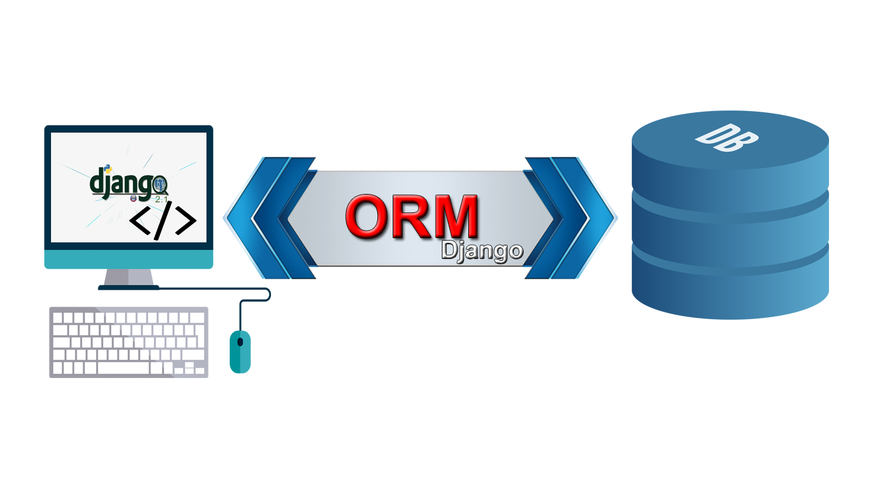

# Proyecto Curso Domina el ORM de Django 
##  🎖️ [Obténlo al Descuento Oficial en Udemy](https://www.udemy.com/course/domina-el-orm-de-django/?referralCode=842EADFD932DB0B55862)  🎖️

##### Código Fuente del Proyecto Domina el ORM de Django por Daniel Bojorge Sequeira

## ☷ Otros Cursos ofrecidos con su Descuento:

☞ Sistema de Compra y Facturación con Python de Django (Hasta 95%)

☞ Domina el ORM de Django (Hasta 90%)

☞ Replicación de Datos con SymmetricDS (Hasta 90%)

☞ Desarrolla Aplicaciones en Capa con ADO NET (Hasta 90%)

☞ Entity FrameWork para principiantes (Hasta 60%)

☞ Y muchos más...

### 💥 Descuento de hasta 95% 💓
##### Precio $9.99 en cualquier curso

##  [Aprovecha Descuento USD 9.99 o menos según tu país en Udemy](https://mailchi.mp/ffe98a904854/mejor-precio-cursos-udemy) 

## ☝ ☝ ☝ ☝ ☝ ☝ ☝☝